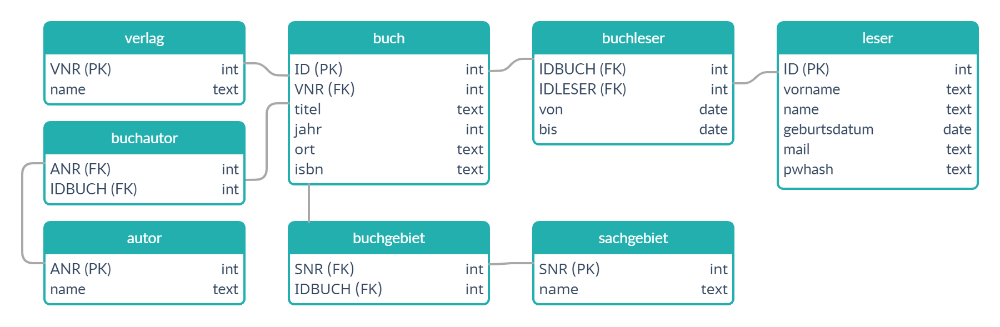

# Bibliothekssystem

[Inf-Schule - Datenbanksysteme](https://www.inf-schule.de/datenbanksysteme/ermodelle/uebung1)

- In der Bibliothek müssen Bücher erfasst werden. Eine Suche ist möglich über Sachgebiet, Autor, Titel, Erscheinungsort und –jahr, Verlag.
- Bei der Suche wird eine Liste aller verfügbaren Verlage vorgeblendet.
- Leser, die Bücher ausleihen wollen, müssen sich zuvor registrieren.
- Für ein Buch kann herausgefunden werden, ob es zur Zeit ausgeliehen ist und von wem.
- Um Schäden nachvollziehen zu können, können alle vorherigen Ausleiher ermittelt werden.
- Bei zu langer Ausleihe erfolgt eine Mahnung an den Leser. Das muss vermerkt werden.



## Setup

Wir arbeiten mit XAMPP...  

> Im Ordner `xampp` befindet sich der Ordner `htdocs`  
> *htdocs* steht für *hypertext documents*.  
> Hier fügen wir den Ordner `biblio` ein um über `http://localhost/biblio/` auf das Bibliothekssystem zugreifen können.

Im Ordner `htdocs` befindet sich außerdem noch die `index.php` Datei.
Nach der XAMPP Installation sieht die Datei folgendermaßen aus.

```php
<?php
    if (!empty($_SERVER['HTTPS']) && ('on' == $_SERVER['HTTPS'])) {
        $uri = 'https://';
    } else {
        $uri = 'http://';
    }
    $uri .= $_SERVER['HTTP_HOST'];
    header('Location: '.$uri.'/xampp/');
    exit;
?>
Something is wrong with the XAMPP installation :-(
```

Dieses Script wird ausgeführt, wenn wir `http://localhost/` aufrufen. Anschließend wird man an `http://localhost/xampp/` weitergeleitet. Um zum Bibliothekssystem weitergeleitet zu werden ersetzen wir `xampp` durch `biblio`.

```php
header('Location: '.$uri.'/biblio/');
```

## Connection

```php
$dbhost = "localhost";
$dbuser = "root";
$dbpass = "";
$dbname = "bibliothekssystem";

$con = new mysqli($dbhost,$dbuser,$dbpass,$dbname);
```

In `connection.php` wird die Verbindung zur Datenbank hergestellt. Wir verwenden `root` als Benutzernamen und als Passwort eine leere Zeichenkette. Der name unserer Datenbank ist `bibliothekssystem`.  
Die Verbindung zur Datenbank wird hier als Objekt mit der Variable `$con` gespeichert. Um die Verbindung nicht immer wieder neu aufbauen zu müssen verwenden wir

```php
include("connection.php");
```

in jedem php-Script in dem wir eine Verbindung zur Datenbank brauchen. So kann auch außerhalb von `connection.php` auf die Variable `$con` zugegriffen werden.

## Funktionen

In `functions.php` werden verschiedene Funktionen definiert. Auch hier können wir mit

```php
include("functions.php");
```

in anderen php-Dateien auf alle hier definierten Funktionen zugreifen. Hiermit vermeiden wir Code-Wiederholungen und können Funktionen einfacher überarbeiten, ohne jedes einzelne Script zu verändern.

### create_table

Mit der `create_table`-Funktion können Tabellen erzeugt werden, ähnlich wie man sie von Inf-Schule aus der [terra1-Datenbank](https://inf-schule-db.informatik.uni-kl.de/SQLterra1.php) kennt.  

Wenn man den HTML-Code der Ausgabe-Tabelle genauer ansieht fällt auf, dass die Tabelle der Klasse `farbig`, jede ungerade Reihe der Klasse `odd` und jede gerade Reihe der Klasse `even` angehört.

```html
<table class="farbig">
<tbody><tr>
    <th>Name</th>
    <th>Land</th>
    <th>Einwohner</th>
    <th>Laenge</th>
    <th>Breite</th>
</tr>
<tr class="odd">
    <td>Kabul</td>
    <td>Afghanistan</td>
    <td>1400000</td>
    <td>69.0000</td>
    <td>34.0000</td>
</tr>
<tr class="even">
    <td>Kandahar</td>
    <td>Afghanistan</td>
    <td>323900</td>
    <td>65.0000</td>
    <td>31.0000</td>
</tr>
</tbody></table>
```

Wenn man sich die dazugehörige [CSS-Datei](https://inf-schule-db.informatik.uni-kl.de/css/datenbankaddon.css) ansieht, wird klar wieso. Die wichtigsten stellen der CSS-Datei `datenbankaddon.css` sehen so aus:

```css
table.farbig  th {
    background-color: rgba(184, 41, 41, 1.0);
}

table.farbig tr.even {
  background-color: rgba(252,203,0,0.2);
}

table.farbig tr.odd {
  background-color: rgba(245, 245, 245, 1.0);
}
```

Hier wird der Hintergrund der Überschriften `th` rot gefärbt. Die geraden und ungeraden Reihen bekommen hier eine unterschiedliche Farbe.  

Der HTML-Code der Ausgabe-Tabelle zeigt außerdem eine regelmäßige Struktur aus der sich mit ein wenig *Reverse Engineering* ein PHP-Script erzeugen lässt, welches Tabellen mit der gleichen Struktur erstellt.

```php
function create_table($result) {
    $n = 0;
    while($row = $result->fetch_assoc()) {
        if ($n == 0){
            echo "<tr>".PHP_EOL;
            foreach (array_keys($row) as $key){
                echo "<th>".$key."</th>".PHP_EOL;
            }
            echo "</tr>".PHP_EOL;
        }
        if ($n % 2 == 0) {
            echo "<tr class=\"even\">".PHP_EOL;
            foreach ($row as $field) {
                echo "<td>".$field."</td>".PHP_EOL;
            }
            echo "</tr>".PHP_EOL;
        }
        else {
            echo "<tr class=\"odd\">".PHP_EOL;
            foreach ($row as $field) {
                echo "<td>".$field."</td>".PHP_EOL;
            }
            echo "</tr>".PHP_EOL;
        }
        $n += 1;
    }
}
```

Der Parameter `$result` ergibt sich aus einer SQL-Abfrage.

```php
$result = $con->query($query);
```

Zunächst braucht man die zählende Variable `$n`, um zu überprüfen, ob es sich um die Reihe der Überschriften, oder ungerade und gerade Reihen handelt.  
Bei den Überschriften wird für jeden Schlüssel aus dem assoziativen Array der `th`-Tag erstellt.  
Bei den Datensätzen wird für jedes Attribut unabhängig vom Schlüssel der `td`-Tag erstellt.  
Je nach dem, ob `$n` gerade ist oder nicht, wird die Reihe der Klasse `even` oder `odd` zugeordnet.
